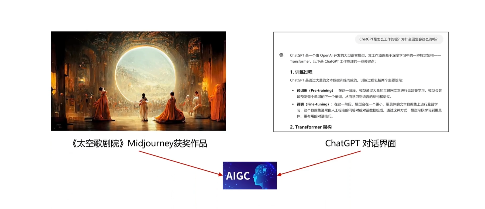
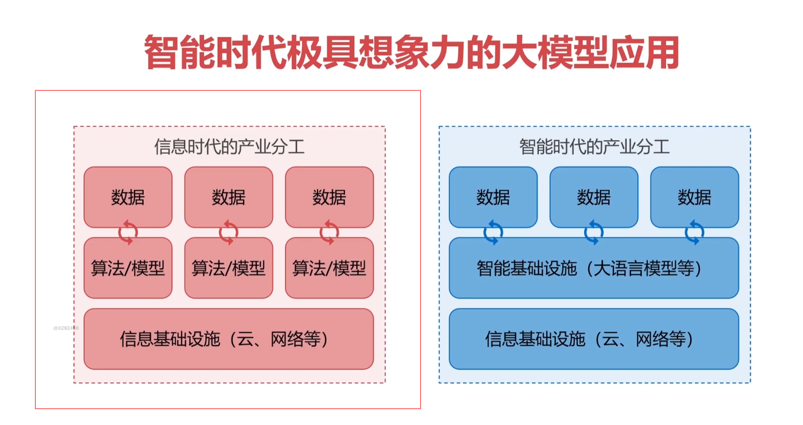
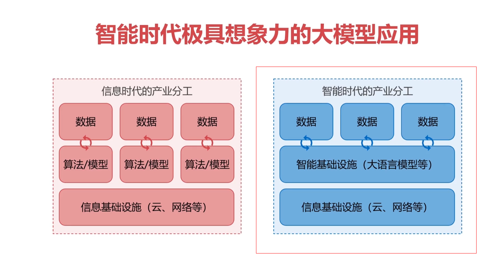
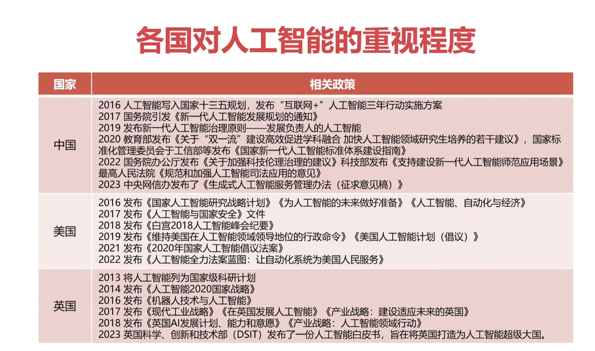
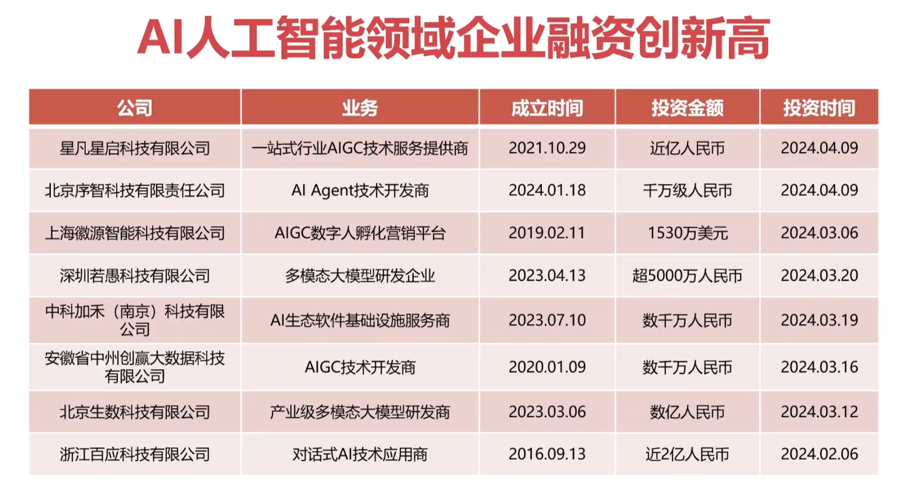
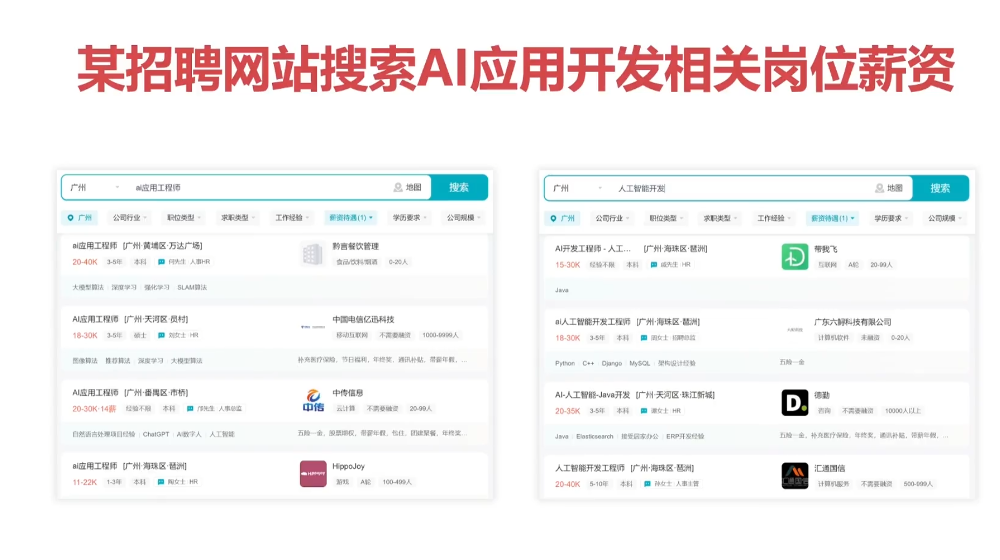

## 1、未来已来，欢迎来到人工智能时代！

> 生产力的进步通常体现在某种新型基础设施的建立

> 例如在工业时代出现的电力基础设施衍生出一大片产业，也解放了大量劳动力。
>
> 而在信息化时代出现了网络作为基础设施，极大地降低了信息交流的成本。
>
> 那么在智能时代将会出现什么基础设施呢？
>
> 这里大胆的断言一下：大模型具备的基础设施潜力

## 2、大模型具备的基础设施潜力

> 因为大模型具备基础设施的三个特征

### 1、通用性

> 传统AI需要针对特定任务设计，具备专用性和垂直性。相比之下，经过高强度预训练的大模型具备灵活应对多种非预设任务的能力，具备强通用性。

### 2、规模经济

> 规模经济与两个概念有关，一个是智能涌现，一个是智能摩尔定律，大模型完美符合。

### 3、外部性

> 修好的路上不通车，价值等于零。尽管大模型的车尚未定义，但是大模型的出现将促进各类“车型”的创新

## 3、AI/LLM的研究分类

### 1、基础研究

> 基础研究努力让模型更“聪明”，涵盖模型核心算法、架构、基础理论、性能优化等，这需要专业的领域知识。

### 2、应用研究

> 或称为LLM应用开发，是指如何将AI应用到实际的业务场景中，让AI技术落地，这块就是我们普通程序员的机会。

## 4、最新的AI应用，都能做什么？

> 左侧这张图叫做太空歌剧院，他是一名艺术家利用Midjourney在2020年创造出来的一幅作品，并且这幅作品在纽约获得了奖项，而右侧这个就是chatgpt的对话页面，这两个是AIGC领域最热门的应用。并且这两款应用都是聊天机器人的形式。

## 5、聊天机器人是AI的终极形态吗？

> 其实不是

### 1、聊天应用仅仅是大模型应用的初级形态！

### 2、各行各业+大模型+原有应用智能化

> 这才是一个富有想象力的未来

### 3、智能时代极具想象力的大模型应用

> 他的产业是如何进行分工的？

> 左侧是传统的信息时代他的产业分工，可以看到数据是直接和算法或者是模型进行交互的。

> 右侧是智能时代的产业分工，可以看到数据他是直接和智能基础设施进行交互的，比方说直接和大语言模型进行交互，也就是未来所有的应用都会接入到大语言模型，让其变得智能，而且这个趋势越来越明显。我们可以从各国对人工智能的重视程度来管中窥豹看一下。

## 6、各国对人工智能的重视程度

+ 这里呢罗列了一张表格，他展示了中美英三国这几年发布的关于人工智能政策信息。
+ 可以看到这些政策是非常多的，这也代表着人工智能在各国的重视程度越来越大，甚至被列为了基建设施。
+ 除了国家的重视，AI人工智能领域企业融资创新高。

+ 这里有一张表格，这张表格只展示了很少很少一部分数据。整张表格是有2000条记录，展示了2022至2024年所有的AI人工智能领域企业的融资情况。
+ 无论是融资频率还是融资的金额都是创历史的新高，并且也是其他行业无法比拟的。
+ 如果这些数据还看得不明显的话可以看一下某招聘网站搜索AI应用开发相关岗位薪资

+ 这些岗位的薪资都是非常高的，而且在北上广深只要你是拥有1-2年经验的AI应用/人工智能开发工程师，月薪普遍在30K以上。
+ 相对于其他的岗位，例如前后端，AI应用开发工程师的岗位相对来说并没有那么卷，因为他仍然是一个新兴行业，目前处于急速发展的阶段。

## 7、学习Ai应用开发有哪些难点？

### 1、资料太少

> 因为他是新技术，所以中文资料太少、技术更新迭代太快新资料太少、教学类视频太少、实战教程就更少，要学习只能自己摸索+读源码，效率太低。

### 2、只是太零散

> 涉猎知识比较宽，网上资料比较分散，缺少系统总结。

### 3、学习深度太浅

> 目前市面上虽然有AI的课程，但是都是讲工具怎么使用的多，或者是讲AI商业模式的多，讲coding的是非常少的，而且结合原理和实践的结合就更少了。

