## 1、Python环境搭建与项目配置

### 1、虚拟环境与编辑器配置

+ Python稳定版与发行版的差异，如何<font color="red" font-size:weight>选择正切的版本</font>，虚拟环境的优缺点与安装，全局配置国内镜像加速包安装。
+ <font color="red" font-weight:900>PyCharm编辑器代码格式化与导入优化</font>，常见快捷键的介绍与使用，插件配置安装，提升开发效率。

### 2、项目架构与框架依赖选择

+ 介绍LLMOps项目的架构与框架依赖选择，配置pipreqs确保项目依赖稳定不胡乱升级导致无法运行。

> 如果不配置的话，在某些情况下，我们将整个项目拷贝到服务器上或者是说发布的时候，安装的依赖版本和开发的版本不一致就可能会导致整个项目无法运行，这也是在生产环境下必须要去配置的一个选项。

+ 整个项目的目录文件约定、命名文件、类文件约定、依赖注入介绍与使用。

> 一来注入可以让整个项目的各个，各个模块进行解耦，提升代码的阅读性并且提升项目的稳定性以及可维护性。

### 3、数据库与Postman接口调试工具

+ 介绍项目使用的数据库Postgres，数据库选择的差异对比，在不同的系统下如何安装配置。
+ 项目API工具Postman的安装，配置环境变量、基础URL、路径参数、授权认证等内容。

## 2、Python环境搭建与配置镜像加速

> 下面将要进行整个项目的开发阶段，会以一个商业级的LLMOps项目作为基础，贯穿整个课程去讲相应的知识点 。

### 1、Python不同版本之间的差异

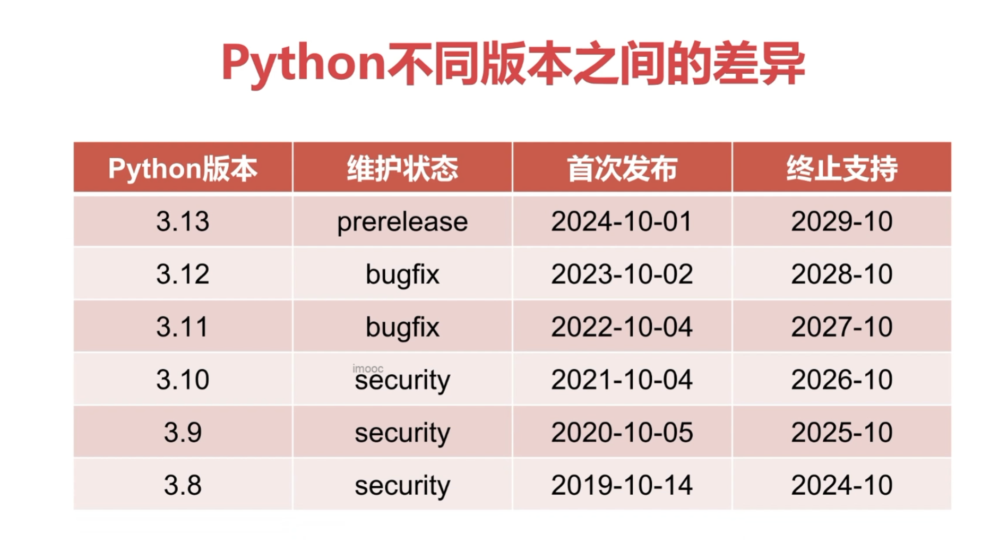

> 可以看到，有Pytrhon版本，有维护状态，有首次发布的时间，有终止支持的时间。这几个字段代表什么意思呢？

#### 1、Python版本


> 前面的3代表的是大版本，后面的13代表的是小版本。
>
> 那么该如何去选择不同的版本呢？
>
> 只需要看这个版本搜对应的维护状态就可以了

#### 2、维护状态

> 可以看到这里面是存在三个维护状态
>
> prerelease
>
> bugfix
>
> security
>
> prerelease是预发布的状态，一般在这个状态下的版本都是最新的版本，他会含有python的一些最新的特性，如果是作为个人学习使用的话，建议使用预发布版本，也就是3.13的版本，
>
> bugfix是维护状态的版本，他一般是安全版本与预发布版本之间的一个过渡版本，在此期间发现的一些BUG他会去作一些维护，这个版本一般使用的比较少。
>
> security是安全版本，安全版本顾名思义就是这个版本下他的表现会相当的稳定，而且该修复的BUG他都已经修复了，而且支持的时间长度一般是比较长的。比如3.10、3.9还有就是3.8的版本都是安全版本。
>
> 安全版本是比较适合在生产环境下去使用的。他的特性可能说没有新版本那么多，但是使用起来更加的稳定。目前市面上大部分的包都是支持安全版本的。
>
> 但是预发布版本可能不支持其中的某些特性。
>
> 所以说就建议，如果个人学习，可以安装3.13，如果是在公司生产环境下去使用，尽可能去使用3.10或者是3.10以下的版本。
>
> 这里的话，我们就会安装3.10的版本。他的首次发布时间是2021-10-04，终止支持时间是2026-10

### 2、如何安装python?

[Python官网](https://www.python.org/)

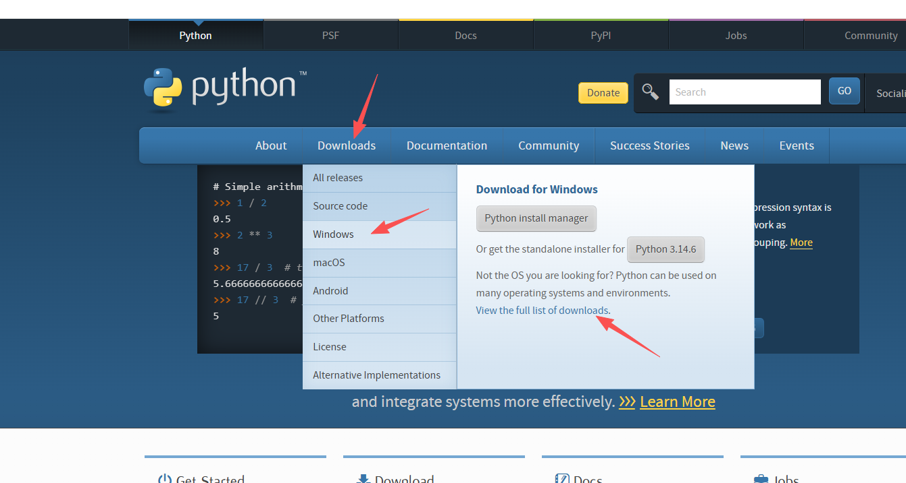

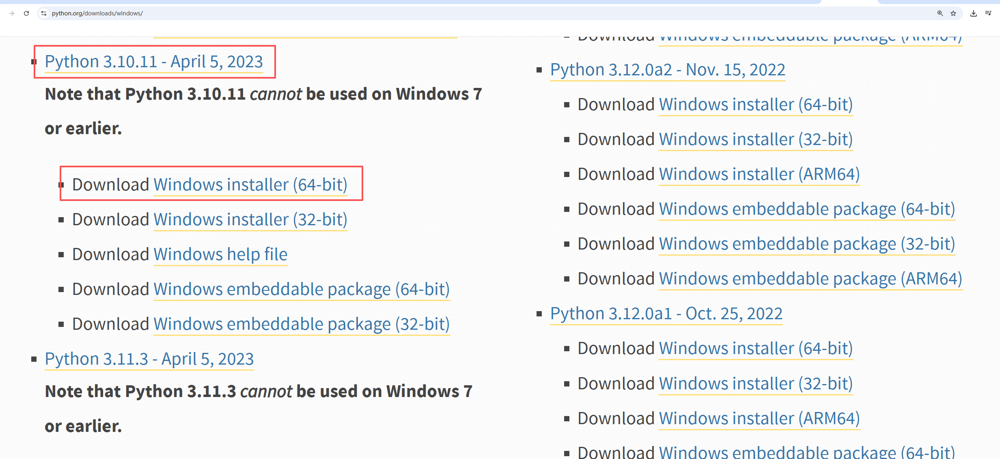

找到对应版本下载完成以后，直接进行安装。勾选上将python添加到环境变量

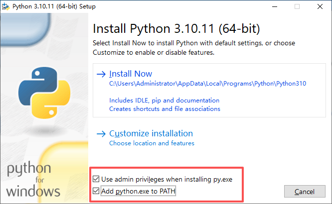

然后选择自定义安装

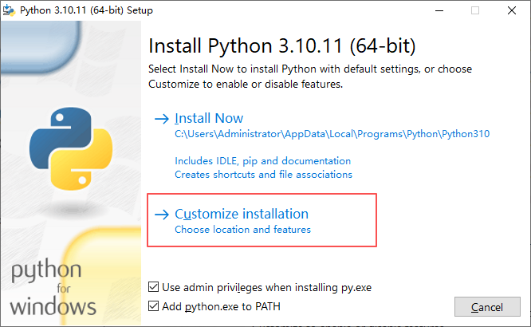

然后选择下一步。

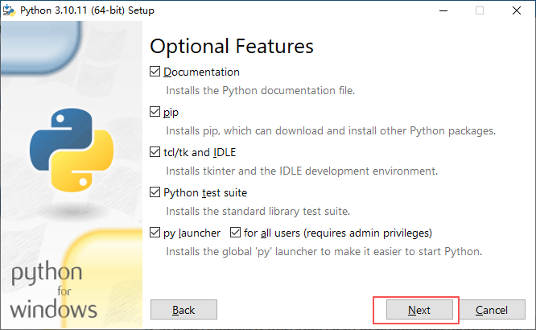

复制最后的路径

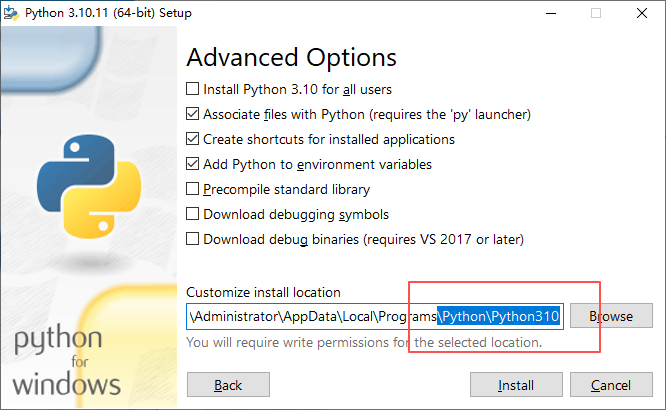

选择一个比较纯净的路径。

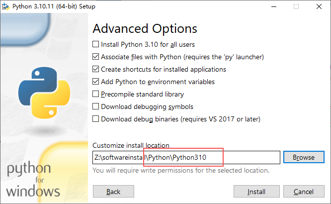

最后选择安装

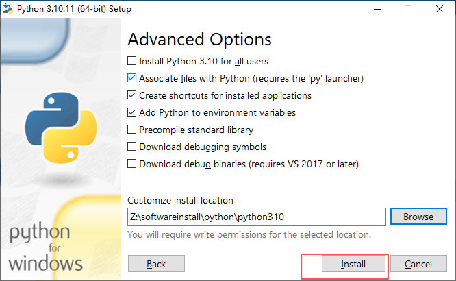

等待进度条完成之后关闭即可，现在python的环境就已经是安装完毕了。

### 3、如何校验python安装成功呢？

> 使用windows+r，输入CMD

输入一下命令

```shell
python --version
```

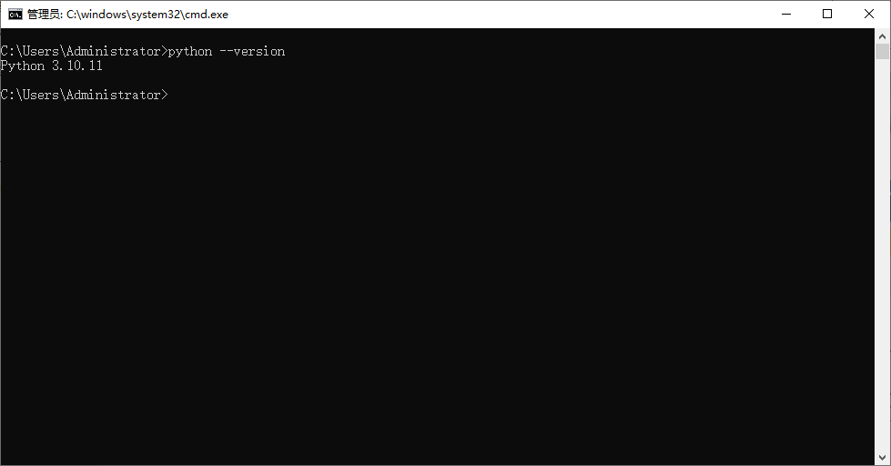

> 现在就已经是存在返回了。那么此时整个python环境就已经是安装完毕了。
>
> 除此之外，通过这种方式安装，还会安装一个pip的命令，输入一下命令

```shell
pip --version
```

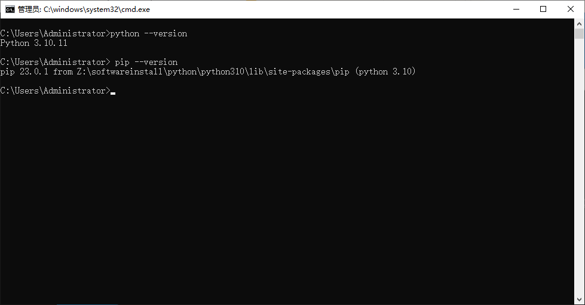

> pip是python中的包管理器。到现在为止整个python环境就已经是安装完成了。

### 4、Python虚拟环境的创建与优缺点

+ 创建虚拟环境命令：<font color="red">python -m venv 环境名</font>，该命令在Python 2.7+或Python 3.3+以上可以使用。

> 为什么不考虑去全局安装，而是去创建一个虚拟的环境呢？这样子会不会多此一举？

+ Python的<font color="red">虚拟环境与系统环境之间是隔离的</font>，一个项目一个虚拟环境，不同的虚拟环境不会相互影响，最大程度避免包冲突。

> 虚拟环境与系统环境之间是隔离的，是什么意思呢？前面安装的环境是整个python系统的环境，如果你在这里面调用pip去安装指定的包，比如说安装了openai的包，那么这个包是整个系统他共享的。这种情况就可能有一种问题，比如说项目A他需要的版本是openai2.0对吧，然后项目B需要的版本是openai1.0，就可能会导致项目的包冲突。但是如果你创建了虚拟环境的话，一个项目他是会制定一个虚拟环境的，不同虚拟环境之间他们是不会相互影响的。最大程度上可以去避免包的冲突。这是他的一个优点，也是非常明显的。、
>
> 虚拟环境的缺点也是很明显的。

+ 占用更大的空间(如果两个项目他们用的包是同一个的话，那么虚拟环境它会复制两份，所以它占用空间会更大，特别是某些机器学习的包 ，他的整个大小可能会有1-2GB，如果创建的项目比较多，很可能硬盘上几百个GB都是这些Python包)，进入虚拟都需要使用命令activate激活才能使用，使用完，要使用deactivate命令退出。

### 5、尝试创建一个虚拟环境

+ 首先在Z盘创建一个文件夹叫做Code

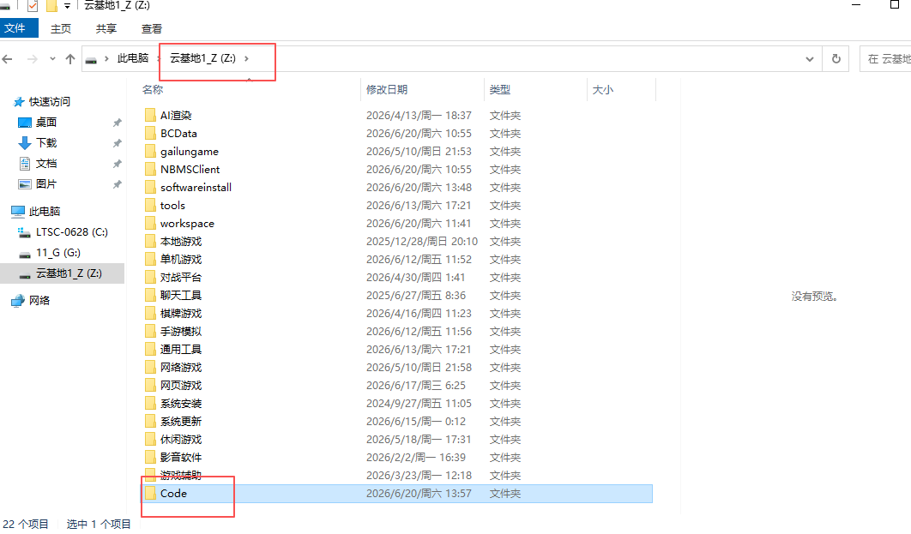

+ 进入文件夹创建一个项目文件夹，明明为llmops

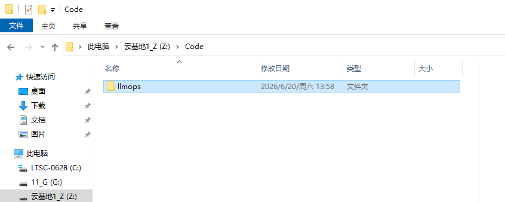

+ 由于是项目分为前端和后端，后端时使用python写的api接口，所以说新建一个文件夹叫做llmops-api

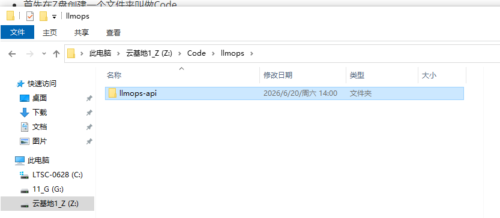

+ 这个文件夹里面存放都是整个api的python的代码，然后在这个文件夹下打开命令行。直接在路径这里输入cmd。

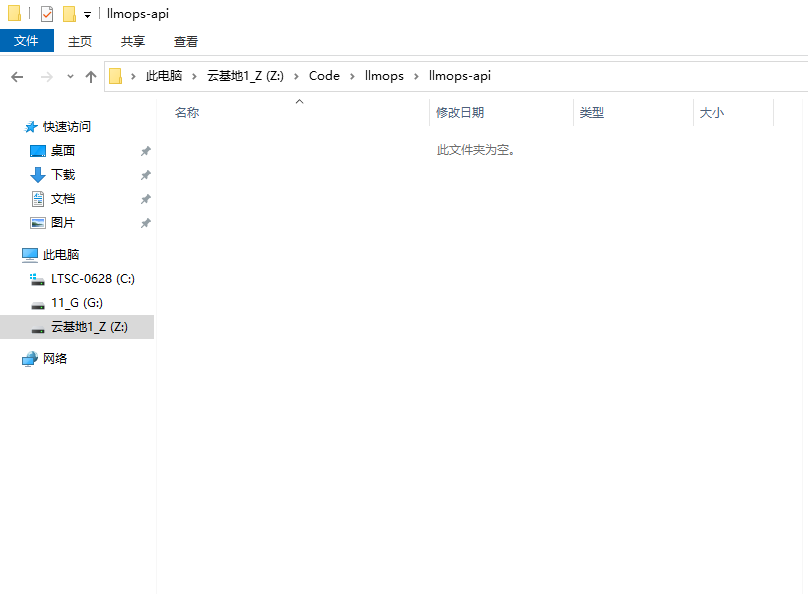

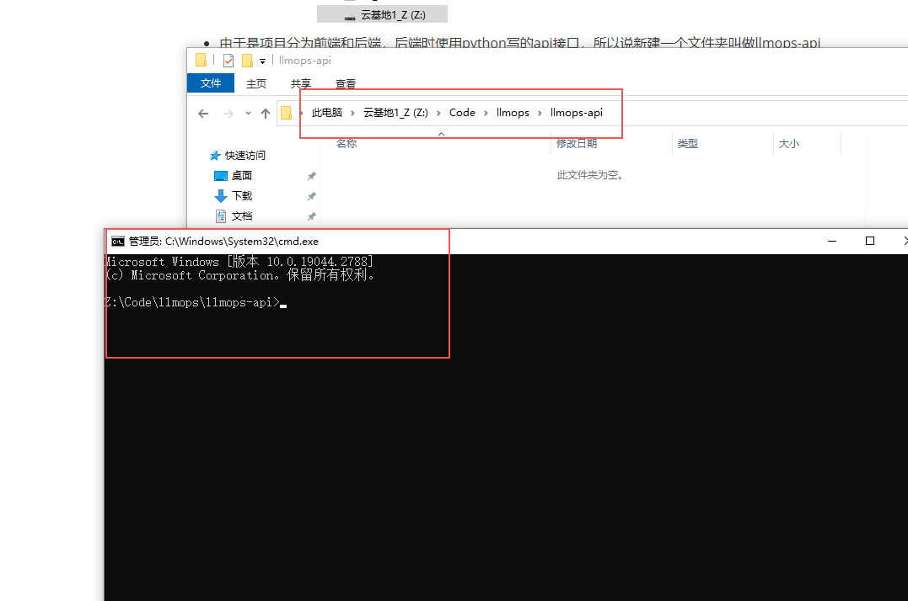

+ 此时的项目还是没有虚拟环境的，使用命令行来进行创建一个。

```shell
python -m venv env
```

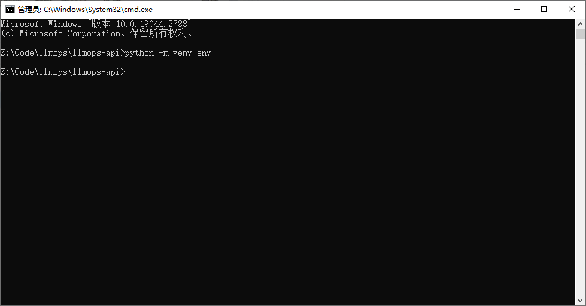

+ 输入命令后回车就会在当前文件夹下创建一个虚拟环境，虚拟环境的表现是什么样的呢？其实他就是一个文件夹。

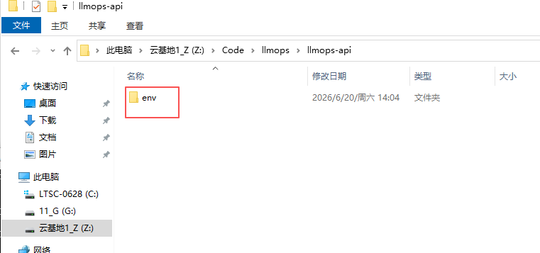

+ 文件夹下面是存在很多东西的。

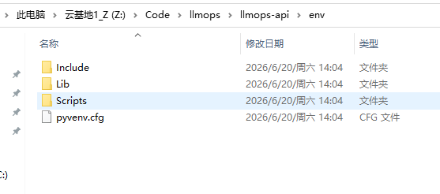

+ 虚拟环境的目录结构和系统环境的目录结构是非常相近的，那么该如何去激活虚拟环境呢？也很简单，打开看看的命令行，执行以下命令

```shell
env\Scripts\activate
```

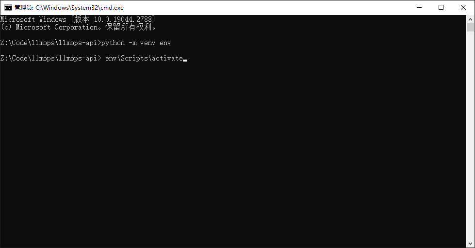

+ 回车。此时窗口会闪烁一下，显示到一下画面。

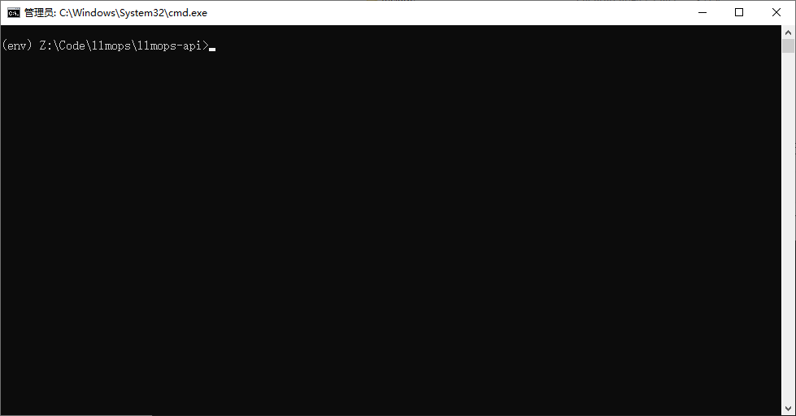

+ 命令行路径的前面就多了一个括号。(env)代表就是说进入到了env的环境。安装的包就会全部到虚拟环境下。
+ 使用以下命令查看一下

```shell
pip install openai    # 安装一个openai的包
```

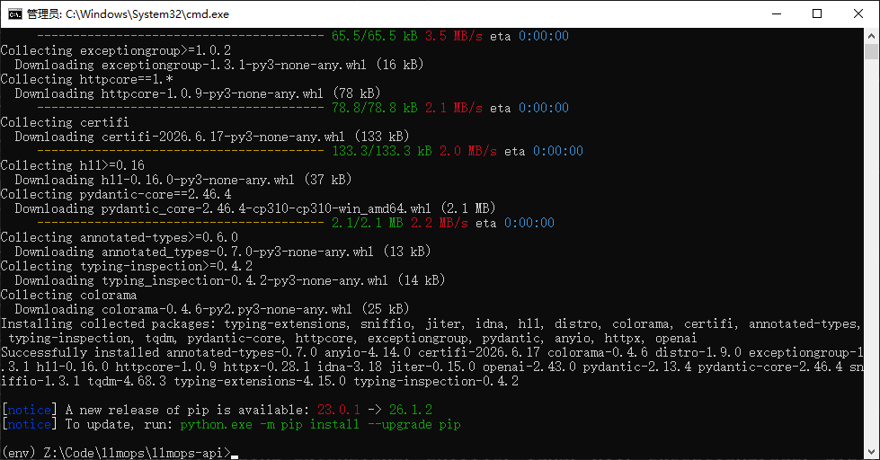

+ 现在openai的包就已经是安装完成了，那么该去哪里找到这个包呢？在以下这个路径

```shell
Z:\Code\llmops\llmops-api\env\Lib\site-packages\openai
```

+ 当整个虚拟环境不需要的时候，直接将env整个文件夹删掉就可以了，他不会影响其他项目的虚拟环境。更不会影响整个系统的环境。

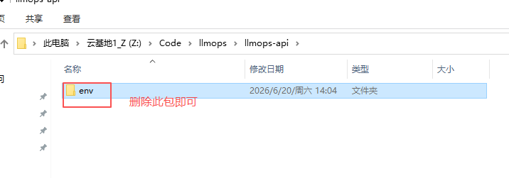

+ 如何在命令行中退出当前的虚拟环境呢？执行以下命令

```shell
env\Scripts\deactivate.bat
```


+ 这个时候就会发现前面的env就消失了。这个时候就表示已经退出了当前的虚拟环境。
+ 这就是一个进入，一个退出命令，这是每次打开命令行都要去执行的，这也是不太方便的点。

### 5、腾讯云pip镜像加速配置

> 当使用pip去下载python包的时候，他默认链接的是外国的网站，众所周知在国内去使用会比较慢，甚至在很多情况下是没有办法去连接的，所以需要将pip去配置一个镜像源，让pip去连接国内的网站，去下载这些Python包。所以镜像加速原理很简单，国内的大企业做了很多社区，比如说像腾讯做了pip的镜像网站，他就拷贝了整个pip的所有内容，让pip可以直接连接到腾讯的网站上进行下载，所以下载速度就会很快。

+ 镜像加速原理，国内网站拷贝了整个pip的所有包，让pip直接连接到国内网站下载，下载会更快。
+ 临时使用：

```shell
pip install -i 镜像地址 <some-package>
```

> 临时使用的意思是在安装某个包的时候，使用pip install 跟上-i 还有镜像地址，这个时候就可以从镜像地址下载指定的包了，但是这种操作他是每一次下载或者是每一次更新某个包都需要去配置，非常的麻烦。所以推荐全局配置

+ 全局使用：

```shell
pip config set global.index-url 镜像地址
```

> 全局配置的意思是只需要配置一次，后续正常的安装，他默认就会从镜像地址里面去下载。

+ 镜像

```shell
https://mirrors.cloud.tencent.com/pypi/simple
```

+ 下面就进行配置，打开刚刚的命令行，切换到对应的虚拟环境下。

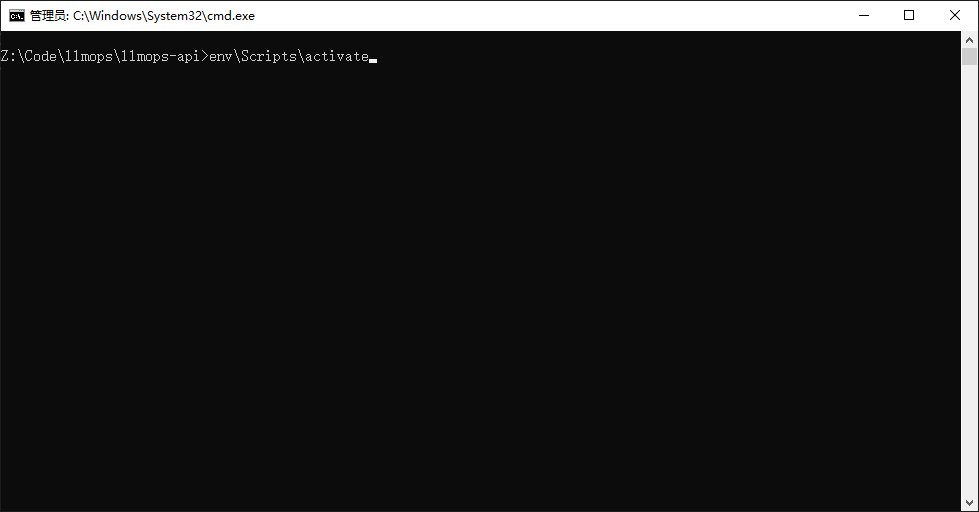

+ 然后输入以下命令

```shell
pip config set global.index-url https://mirrors.cloud.tencent.com/pypi/simple
```

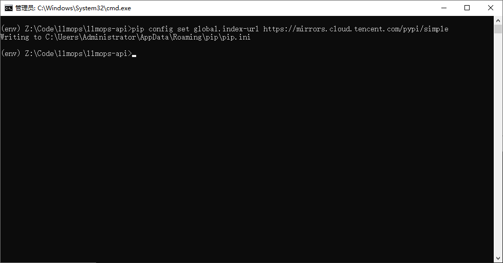

+ 回车之后就已经将配置文件写入了，如何验证配置已经生效呢？输入以下命令

```shell
pip config list
```


+ 此时就输出了所有的配置信息，这里它展示了全局的索引加速地址是腾讯的地址。
+ 这个时候，再去安装包他的速度就会非常的快了。

## 3、PyCharm配置已经生成的虚拟环境

### 1、拉取代码之后

> 首先设置虚拟环境包env下的pyvenv.cfg文件

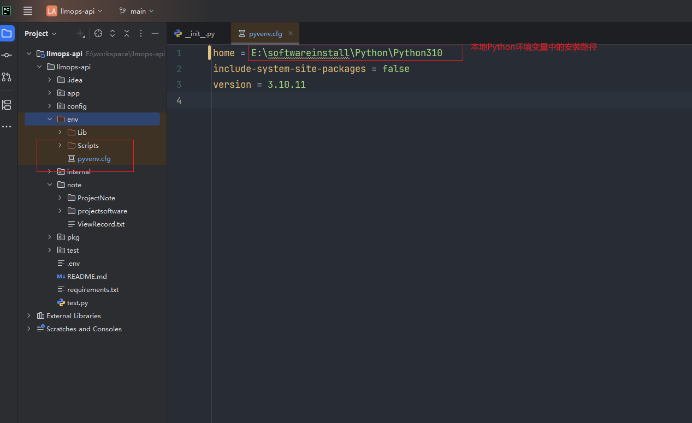

> 确保安装python的路径正确之后，找到PyCharm的设置

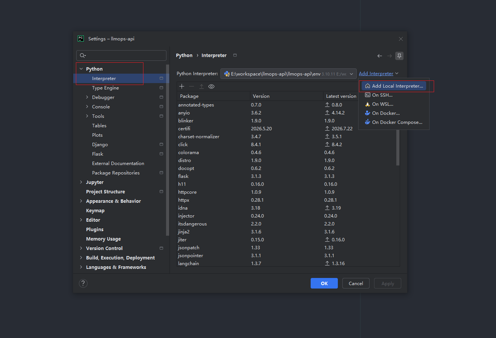

> 找到项目中已经存在的python.exe进行选择即可。

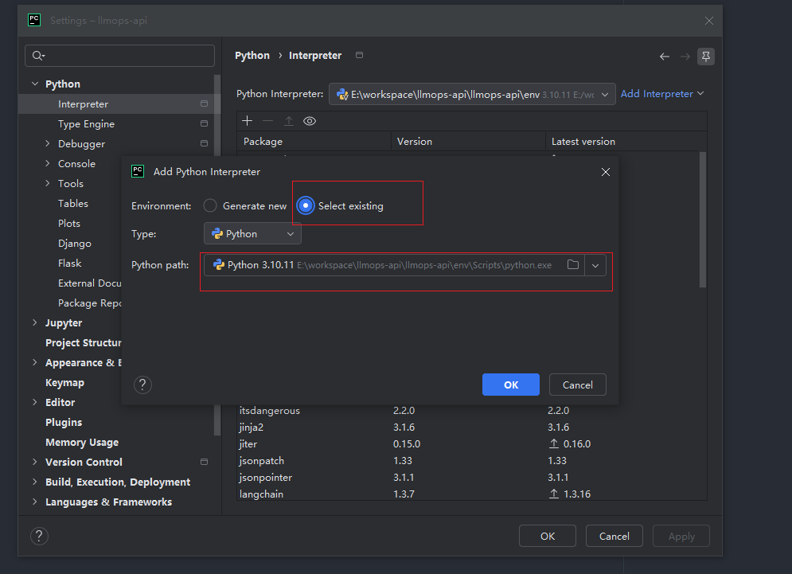

> 这样项目即可选择已经存在的虚拟环境路径。

## 4、PyCharm基础配置

### 1、基础设置

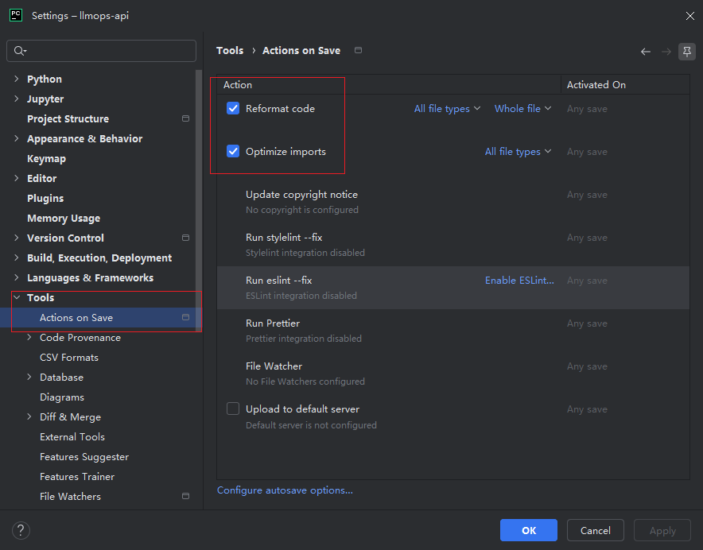

> 勾选这两个。

### 2、插件安装

## 5、项目架构与基础框架选择

### 1、LLMOps项目七层架构


+ 第一层架构叫做表示层，也叫做用户层，这里总共是包含了整个PC网站，开放API，或者是APP

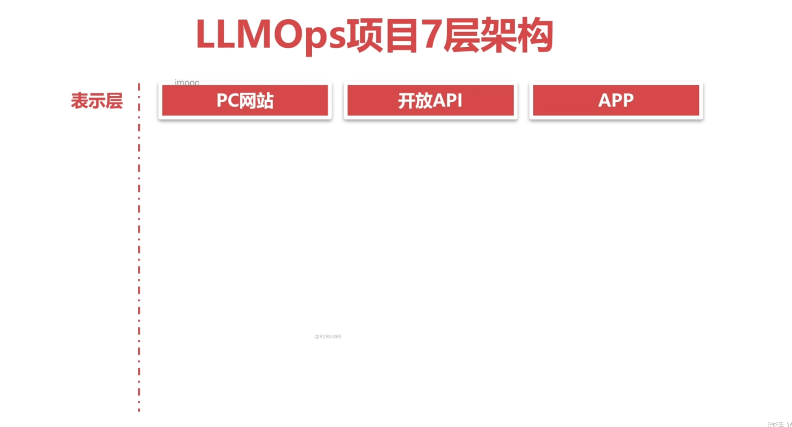

+ 


